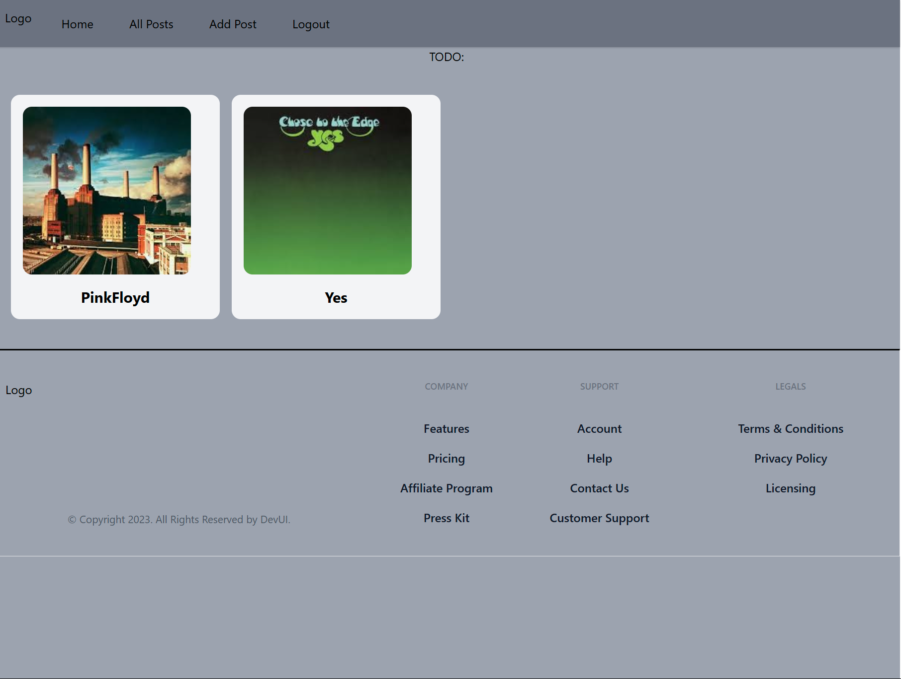
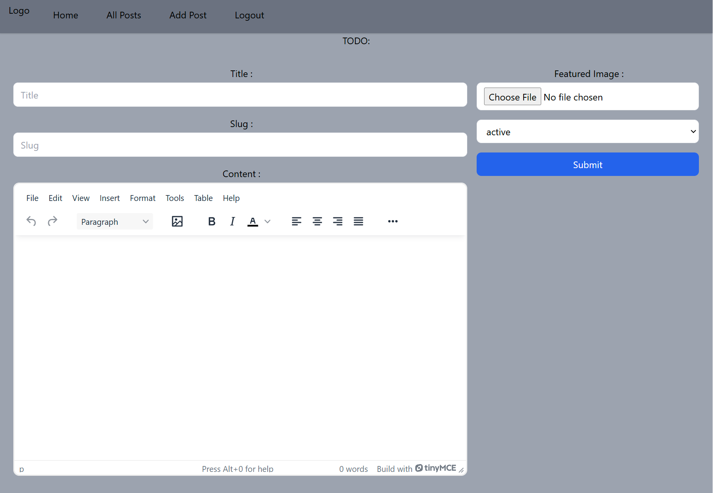

# Project Name

A brief description of your project. For example: "A web application for managing tasks with a React frontend and Appwrite backend."

## Features

- User authentication with Appwrite
- Create, read, update, and delete (CRUD) operations on documents
- Responsive UI built with React
- Real-time data updates

## Technologies Used

- **Frontend**: React
- **Backend**: Appwrite
- **Styling**: CSS, or any UI library you are using (= Tailwind CSS)
- **State Management**: (if applicable, e.g., Redux)

###    SignUp Component


*SignUp component for the Webpage*

### Displaying Added Posts



*Description: The main chat interface where users can send and receive messages in real-time.*

###    Adding New Posts



*Description: Displaying Editor to add new posts*


## Getting Started

### Prerequisites

Make sure you have the following installed:

- Node.js (version x.x.x)
- npm or yarn
- Appwrite server running locally or on a remote server

### Installation

1. **Clone the repository**:

   ```bash
   git clone https://github.com/yourusername/your-repo-name.git
   cd your-repo-name
